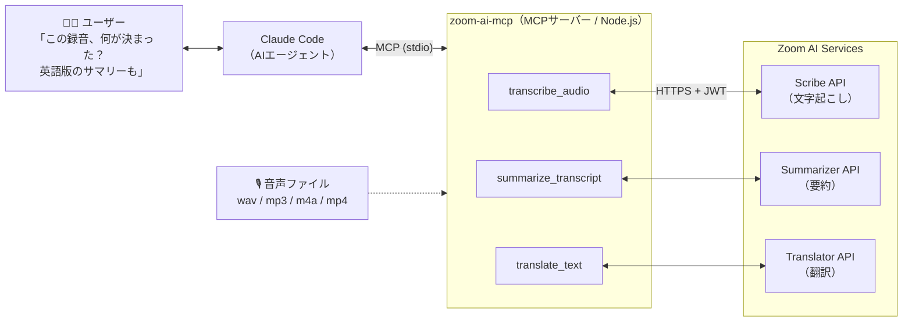

# Zoom AI ServicesをMCPサーバー化してClaude Codeから使ってみた

## はじめに

Zoom AI Services には文字起こし(Scribe)・翻訳(Translator)・要約(Summarizer)の3つの API があります。これを普通に使うなら、「録音 → 文字起こし → 要約 → Slack 通知」みたいなパイプラインを組むことになると思います。ただこの方式だと、用途が1つ増えるたびにパイプラインをもう1本書くことになります。

今回は別のアプローチを試しました。3つの API を MCP(Model Context Protocol)のツールとしてエージェントに渡して、**どの API をどの順番で呼ぶかはエージェント自身に判断させる**、という構成です。要するに、エージェントから音声処理 API を直接呼べるようにします。

この記事では、その MCP サーバーの実装と、Claude Code に接続して動かした検証結果(精度・レイテンシ・ハマったところ)を書きます。

## 作ったもの



どのツールをどの順で呼ぶかは、エージェントが自分で判断します。

公開する MCP ツールは3つです。

| ツール | 使用API | 機能 |
|---|---|---|
| `transcribe_audio` | Scribe | 音声/動画(wav/mp3/m4a/mp4)を文字起こし。ローカルパスとURL両対応 |
| `summarize_transcript` | Summarizer | 会話テキストを要約。recap / action_items / summary / full_summary |
| `translate_text` | Translator | 9言語間翻訳。4,000字制限は自動チャンク分割で回避 |

依存パッケージは `@modelcontextprotocol/sdk` と `zod` の2つ、全体で300行弱です。

リポジトリ: https://github.com/rai03k/zoom-ai-mcp

## Zoom AI Services とは

Zoom が出している開発者向けの AI API 群です。名前から Zoom 会議専用かと思っていたのですが、実際は会議とは無関係に、任意の音声ファイルやテキストに対して使えます。

- **Scribe API** — 音声文字起こし
- **Translator API** — 日英中韓など9言語のテキスト翻訳
- **Summarizer API** — 会話テキストの要約。プレーンテキストの他 VTT/SRT も入力可

3つとも同期(Fast)モードがあります。リクエストして数秒で結果が返ってくるので、MCP のツール呼び出しの中で処理を完結させられます。ここが今回の構成で一番効いているところで、ツール呼び出し1回で「音声を渡して文字起こしが返る」が成立します。大量ファイル向けには非同期の Batch モードも用意されています。

## 実装

### 認証: JWT を自前生成する

Zoom Build Platform の API Key / Secret から HS256 の JWT を作って、Bearer トークンとして送るだけです。OAuth のリダイレクトフローはありません。JWT の生成は Node 標準の `crypto` だけで実装できます。

```typescript
import { createHmac } from 'node:crypto'

function generateJWT(): string {
    const b64url = (input: string | Buffer) => Buffer.from(input).toString('base64url')
    const now = Math.round(Date.now() / 1000)
    const header = b64url(JSON.stringify({ alg: 'HS256', typ: 'JWT' }))
    const payload = b64url(JSON.stringify({
        iss: process.env.ZOOM_API_KEY,  // issuer = API Key
        iat: now - 30,
        exp: now + 60 * 60,
    }))
    const signature = createHmac('sha256', process.env.ZOOM_API_SECRET!)
        .update(`${header}.${payload}`).digest('base64url')
    return `${header}.${payload}.${signature}`
}
```

### ツール1: transcribe_audio

Scribe の Fast エンドポイント(`POST /v2/aiservices/scribe/transcribe`)は、`file` に URL または data URI(base64)を受け取ります。ローカルファイルの場合は base64 化して data URI で送ります。

```typescript
const AUDIO_MIME: Record<string, string> = {
    '.wav': 'audio/wav', '.mp3': 'audio/mpeg',
    '.m4a': 'audio/mp4', '.mp4': 'video/mp4',
}

export async function transcribe(source: string, language: string, channelSeparation: boolean) {
    let file: string
    if (/^https?:\/\//.test(source)) {
        file = source
    } else {
        const mime = AUDIO_MIME[extname(source).toLowerCase()]
        const data = await readFile(source)
        file = `data:${mime};base64,${data.toString('base64')}`
    }
    return post('/scribe/transcribe', {
        file,
        config: { language, channel_separation: channelSeparation },
    })
}
```

MCP ツールとしての登録はこうです。MCP では、エージェントが `description` を見てツールの使い方を判断します。なので「ローカルパスと URL の両方を受け付ける」ことは description に書いておきます。

```typescript
server.registerTool(
    'transcribe_audio',
    {
        title: 'Transcribe audio (Zoom Scribe)',
        description:
            'Transcribe an audio/video file to text using the Zoom Scribe API. ' +
            'Accepts a local file path or an https URL (wav / mp3 / m4a / mp4).',
        inputSchema: {
            source: z.string().describe('Local file path or https URL of the audio/video file'),
            language: z.string().default('ja-JP').describe('BCP-47 language code of the audio'),
            channel_separation: z.boolean().default(false),
        },
    },
    async ({ source, language, channel_separation }) => {
        const data = await transcribe(source, language, channel_separation)
        // タイムスタンプ付きセグメントも整形して返す(省略)
        return { content: [{ type: 'text', text: data.result.text_display }] }
    },
)
```

### ツール2: summarize_transcript

Summarizer(`POST /v2/aiservices/summarizer/summarize`)は `task` パラメータで出力の種類を選べます。

- `recap` — 短い振り返り
- `action_items` — TODO 抽出
- `summary` / `full_summary` — 標準/詳細の要約

```typescript
export async function summarize(text: string, task: SummarizerTask, language: string) {
    return post('/summarizer/summarize', {
        input: { text },
        config: { task, language, summary_type: 'conversation' },
    })
}
```

出力言語に `ja-jp` を指定できます。入力上限は 96KB です。

### ツール3: translate_text と 4,000字制限

Translator の Fast エンドポイントには入力4,000字までという制限があります。長い議事録をそのまま投げると弾かれるので、サーバー側で文境界のチャンク分割を入れました。

```typescript
const TRANSLATE_LIMIT = 4000

export function splitForTranslation(text: string, limit = TRANSLATE_LIMIT): string[] {
    if (text.length <= limit) return [text]
    const chunks: string[] = []
    let current = ''
    // 段落境界 → 文末(。！？!?.)の優先順で分割点を探す
    const pieces = text.split(/(?<=\n\n)|(?<=[。！？!?.]\s?)/)
    for (const piece of pieces) {
        if (piece.length > limit) {  // 1文が4,000字超なら強制分割
            if (current) { chunks.push(current); current = '' }
            for (let i = 0; i < piece.length; i += limit) chunks.push(piece.slice(i, i + limit))
            continue
        }
        if (current.length + piece.length > limit && current) {
            chunks.push(current)
            current = ''
        }
        current += piece
    }
    if (current) chunks.push(current)
    return chunks
}
```

この制限はエージェントに意識させたくないので、MCP サーバー側で吸収しています。エージェントは長さを気にせず「翻訳して」と呼ぶだけで済みます。API の都合をどこまでツール側で隠すかは MCP サーバー設計のわりと本質的な部分だと思っていて、今回はここに一番気を使いました。

## Claude Code に接続する

```bash
claude mcp add zoom-ai \
  -e ZOOM_API_KEY=your_api_key \
  -e ZOOM_API_SECRET=your_api_secret \
  -- node /path/to/zoom-ai-mcp/dist/index.js
```

Claude Desktop の場合は `claude_desktop_config.json` に同等の設定を書きます。

## デモ: エージェントが自分で API を組み合わせる

Claude Code に日本語音声ファイルを渡して、こう頼みました。音声は公式の [ai-services-quickstart](https://github.com/zoom/ai-services-quickstart) リポジトリに入っているサンプル(`sample_data/ja-JP_base.wav`)です。

> test-data/ja-JP_base.wav に何が録音されているか教えてください。その内容の英訳も欲しいです。

Claude の回答(実際の出力):

> `ja-JP_base.wav`(約10.6秒)の内容は以下の通りです。
>
> **文字起こし(Zoom Scribe API):**
> > これは音声生成を行う方法を示すコード例です。この機能を実装するために、シンプルなテキスト読み上げライブラリを使用します。
>
> **英訳(Zoom Translator API):**
> > This is a code example that demonstrates how to generate audio. We will use a simple text-to-speech library to implement this functionality.

こちらからは、どのツールを使えとは一切指定していません。`transcribe_audio` → `translate_text` という順序は Claude が自分で判断して実行したものです。パイプラインのコードは1行も書いていません。

会議のテキストに対して `summarize_transcript` を `action_items` タスクで呼ばせると、担当者別の TODO として返ってきます。

```
**佐藤**
- QAで問題があればすぐ共有する

**鈴木**
- リリースノートを水曜日までに用意する
- 英語版の告知文を金曜日までに作成する
```

## 検証: 精度・レイテンシ・ハマったところ

### レイテンシ実測(東京から、Fast モード)

| API | 入力 | レイテンシ |
|---|---|---|
| Scribe | 日本語音声 10.6秒(457KB wav) | 2.3秒 |
| Scribe | 日本語音声 31.6秒(話者2名) | 2.5秒 |
| Summarizer (action_items) | 会議テキスト約300字 | 1.9秒 |
| Summarizer (recap) | 同上 | 1.5秒 |
| Translator | 日本語80字 → 英語 | 0.8秒 |
| Translator | 日本語4,560字(2チャンク分割) → 英語 | 4.1秒 |

対話的に使っていて待たされる感じはありませんでした。今回の測定では、文字起こしは音声時間の4〜5倍速くらいで処理されています。

### 精度の所感

- 日本語文字起こし: サンプル音声(合成音声)では誤字ゼロでした。句読点も自然に付きます
- 要約: 「誰が・何を・いつまでに」を取りこぼしなく抽出。日本語出力も不自然さがない
- 翻訳: 「来週金曜の7月17日」→「next Friday, July 17」のように日付表現も正確でした

### ハマったところ

1. **`channel_separation` は声を聞き分ける話者分離(ダイアライゼーション)ではない**。名前からダイアライゼーションを期待して `true` を渡したのですが、モノラル録音では話者ラベルが付きませんでした。左右のチャンネルに別々の音声を入れたステレオファイルで試したところ、`Speaker 1L` / `Speaker 1R` というチャンネル単位のラベルが付きます。ただし同じチャンネル内に2人の声が混ざっている場合は区別されず、同じラベルになりました。左右のマイクを分けて録音するコールセンター(左=オペレーター、右=顧客)のような音源向けの機能です
2. **Translator の4,000字制限**は前述のチャンク分割で回避しました。今回のサンプルでは、分割による明確な品質低下は確認できませんでした。レイテンシがチャンク数にほぼ比例して伸びるだけです
3. **レスポンスの `model` フィールドが日本語音声でも `zoom-asr-en-v1`** と返ってきます。最初「言語指定を間違えた?」と思いましたが、結果は正しい日本語でした。言語別モデルではなく多言語単一モデルなのだと思います
4. Zoom App Marketplace の画面には **SDK credentials と API keys の2種類が表示されます**。今回の API で使うのは「API keys」の方です(SDK credentials は Video SDK 用)。JWT の `iss` に SDK Key を入れても認証は通らないので注意してください

### 料金

今回の検証全体(文字起こし約1分、要約×3、翻訳約5,000字)で消費したクレジットは約1円相当でした。無料の $20 クレジットの範囲で、かなり遊べます。

## まとめ

- Zoom AI Services の3 API はどれも同期モードがあり、MCP ツールとして扱いやすい
- 依存2パッケージ・300行弱で、エージェントから音声を扱えるようになった
- 固定パイプラインを書かなくても、エージェント側で「音声 → 翻訳」や「音声 → 要約 → TODO化」のような処理を組み合わせられる
- API の制限(4,000字など)はツール側で吸収しておくと、エージェントの挙動が安定する

作ってみて面白かったのは、議事録の自動化そのものより、音声をそのまま開発ワークフローの入力として扱えるようになったことです。「さっきの打ち合わせで話した仕様変更を整理して、関連する実装箇所を探して」のような使い方も、この構成なら特別な作り込みなしで動きます。

コードは公開しています: https://github.com/rai03k/zoom-ai-mcp
